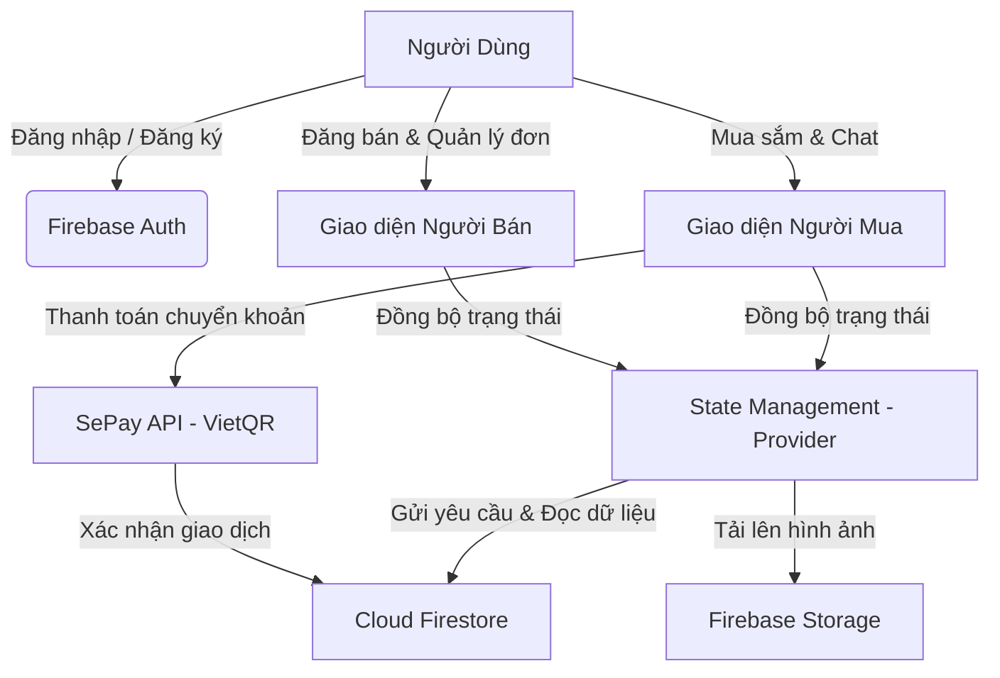

# 🛍️ Era Store - Ứng dụng Quản lý & Mua bán đơn hàng trực tuyến

> **Đồ án môn học:** Nhập môn Công nghệ Phần mềm (SE104)  
> **Nền tảng phát triển:** Flutter & Firebase  
> **Thiết kế giao diện:** Dark Mode Modern (Phong cách Etsy)  

---

## 📌 Giới thiệu ứng dụng

**Era Store** là một ứng dụng di động thương mại điện tử hiện đại được xây dựng dựa trên nền tảng **Flutter** và **Firebase**. Lấy cảm hứng từ mô hình C2C (Customer-to-Customer) của Etsy, ứng dụng cho phép người dùng dễ dàng chuyển đổi linh hoạt giữa vai trò **Người mua (Buyer)** và **Người bán (Seller)**. 

Với giao diện tối sang trọng (Dark Theme) tối ưu hóa trải nghiệm người dùng, tích hợp các tính năng thông minh như Chat thời gian thực, Thanh toán tự động qua mã VietQR (SePay API), và quản lý trạng thái đơn hàng đa cấp, **Era Store** mang lại giải pháp quản lý & mua bán hàng hóa toàn diện và mượt mà.

---

## ✨ Các chức năng chính

### 👤 Vai trò Người mua (Buyer)
* **Đăng ký & Đăng nhập:** Hệ thống xác thực an toàn thông qua Firebase Authentication.
* **Khám phá sản phẩm:** Duyệt sản phẩm theo danh mục (Categories), tìm kiếm thông minh, hiển thị giá ưu đãi và đánh giá sao trung bình.
* **Chi tiết sản phẩm:** Xem thông tin mô tả chi tiết, hình ảnh chất lượng cao, số lượng hàng còn lại trong kho, danh sách mã giảm giá (voucher) áp dụng và đọc phản hồi từ các khách hàng trước.
* **Yêu thích (Favorites):** Lưu trữ sản phẩm quan tâm vào danh sách yêu thích cá nhân.
* **Giỏ hàng tiện lợi:** Thêm/sửa/xóa sản phẩm, tự động tính tổng tiền theo các sản phẩm được chọn thanh toán.
* **Đặt hàng & Thanh toán:** Tích hợp tạo mã VietQR tự động qua SePay API giúp khách hàng quét mã chuyển khoản ngân hàng nhanh chóng với nội dung giao dịch chuẩn hóa.
* **Theo dõi đơn hàng (Timeline):** Trạng thái cập nhật rõ ràng theo từng bước: `Đã đặt hàng` ➔ `Đang giao` ➔ `Đã giao` ➔ `Đã hủy`.
* **Chat thời gian thực (Real-time Chat):** Nhắn tin trực tiếp với chủ shop để trao đổi thêm về sản phẩm.
* **Đánh giá & Phản hồi:** Đánh giá sao (1-5 ⭐) và viết bình luận sau khi nhận hàng thành công.
* **Trả hàng & Hoàn tiền:** Gửi yêu cầu hoàn tiền kèm hình ảnh minh chứng và lý do cụ thể khi sản phẩm lỗi.

### 🏪 Vai trò Người bán (Seller)
* **Đăng ký gian hàng:** Nâng cấp tài khoản bằng cách điền thông tin tài khoản ngân hàng nhận tiền thụ động.
* **Đăng bán sản phẩm:** Tạo sản phẩm mới kèm hình ảnh tải lên từ thư viện điện thoại, thiết lập danh mục, giá bán, giá cũ (khuyến mãi) và số lượng tồn kho.
* **Quản lý kho hàng:** Cập nhật thông tin chi tiết hoặc gỡ bỏ (xóa) các sản phẩm đang bán.
* **Quản lý đơn hàng:** Tiếp nhận đơn hàng từ người mua, cập nhật trạng thái đơn (chuyển sang giao hàng, hoàn tất đơn), xem chi tiết thông tin giao hàng của khách.
* **Xử lý trả hàng:** Xét duyệt (Đồng ý / Từ chối) các yêu cầu trả hàng của người mua.
* **Thống kê doanh thu:** Dashboard hiển thị trực quan tổng doanh thu, biểu đồ hoặc danh sách lịch sử bán hàng chi tiết.

---

## ⚙️ Cách thức hoạt động của hệ thống



1. **Quản lý trạng thái (State Management):** Ứng dụng sử dụng mô hình `Provider` để quản lý trạng thái cục bộ của ứng dụng (User, Cart, Favorites, Products, Search). Khi có bất kỳ thay đổi nào từ UI, Provider sẽ xử lý logic và kích hoạt cập nhật giao diện ngay lập tức.
2. **Thời gian thực (Real-time Synchronization):** Firestore Streams được sử dụng cho các luồng dữ liệu cần tính tức thì như Tin nhắn Chat, Đơn hàng, Trạng thái Kho hàng. Người mua và người bán nhận phản hồi lập tức mà không cần tải lại trang.
3. **Luồng thanh toán tự động:**
   * Khi tạo đơn hàng, hệ thống lấy thông tin ngân hàng của người bán.
   * Kết nối với SePay API để sinh mã QR động chứa sẵn: **Số tài khoản người bán**, **Số tiền cần thanh toán**, và **Nội dung chuyển khoản chuẩn hóa** (chứa ID đơn hàng).
   * Khi khách hàng chuyển khoản thành công, hệ thống sẽ tự động cập nhật trạng thái đơn và đồng bộ doanh thu cho người bán.

---

## 📦 Các thư viện chính sử dụng

Ứng dụng sử dụng các gói thư viện Flutter phổ biến dưới đây (chi tiết cấu hình tại [pubspec.yaml](file:///c:/Github/SE104_AppProject/pubspec.yaml)):

| Thư viện | Phiên bản | Công dụng |
| :--- | :--- | :--- |
| `firebase_core` | `^4.4.0` | Khởi tạo kết nối với dịch vụ Firebase. |
| `firebase_auth` | `^6.1.4` | Quản lý đăng ký, đăng nhập và xác thực người dùng. |
| `cloud_firestore` | `^6.1.2` | Cơ sở dữ liệu NoSQL lưu trữ thông tin người dùng, sản phẩm, đơn hàng, chat, đánh giá. |
| `firebase_storage` | `^13.4.1` | Lưu trữ tệp tin hình ảnh sản phẩm, ảnh đại diện, ảnh bằng chứng trả hàng. |
| `provider` | `^6.1.1` | Quản lý trạng thái ứng dụng tập trung (State Management). |
| `intl` | `^0.20.2` | Hỗ trợ định dạng tiền tệ Việt Nam Đồng (`vi_VN` - đ) và hiển thị ngày giờ thân thiện. |
| `image_picker` | `^1.2.2` | Cho phép người dùng chụp ảnh hoặc chọn ảnh từ album thiết bị. |
| `cached_network_image` | `^3.4.1` | Hiển thị hình ảnh từ internet, hỗ trợ bộ nhớ đệm (cache) giúp ứng dụng chạy mượt mà hơn. |
| `url_launcher` | `^6.2.4` | Kích hoạt cuộc gọi, mở trình duyệt web bên ngoài khi cần thiết. |
| `http` | `^1.6.0` | Thực hiện các yêu cầu HTTP API bên ngoài. |
| `flutter_launcher_icons` | `^0.14.4` | Tự động tạo và cấu hình icon ứng dụng trên Android & iOS. |

---

## 🗄️ Thiết kế Cơ sở dữ liệu (Database Schema)

Ứng dụng sử dụng **Google Firebase Cloud Firestore** làm cơ sở dữ liệu chính với mô hình NoSQL. Các tài liệu (documents) được lưu trữ và quản lý thông qua 5 collections chính sau:

1. **Collection `users`**: Lưu trữ thông tin tài khoản của người dùng (Email, Họ tên, Mật khẩu, Địa chỉ, Số điện thoại, Tiểu sử).
   * *Đối với Người mua*: Lưu trữ thêm thông tin giỏ hàng hiện tại, các mã giảm giá và lịch sử mua hàng.
   * *Đối với Người bán*: Lưu trữ thêm tổng doanh thu tạm tính, danh sách sản phẩm đang bán, lịch sử đơn bán và thông tin tài khoản ngân hàng liên kết (Tên ngân hàng, Số tài khoản, Chủ tài khoản) để nhận tiền chuyển khoản thanh toán.
2. **Collection `products`**: Lưu trữ danh sách sản phẩm đang được đăng bán trên ứng dụng bao gồm: Tên sản phẩm, Giá bán, Giá cũ (khuyến mãi), Mô tả sản phẩm, Ngành hàng/Danh mục, Số lượng tồn kho, ID/Tên người bán, cùng điểm số đánh giá trung bình và số lượng lượt đánh giá.
3. **Collection `orders`**: Lưu trữ thông tin giao dịch mua bán bao gồm: ID người mua, ID người bán, danh sách sản phẩm được mua, tổng số tiền thanh toán, trạng thái đơn hàng (Đã đặt, Đang giao, Đã giao, Hủy đơn, Đang hoàn trả...), mốc thời gian chuyển trạng thái đơn (Timeline), thông tin đánh giá đơn hàng (số sao, nhận xét) và nội dung yêu cầu trả hàng của người mua (lý do, hình ảnh đính kèm).
4. **Collection `reviews`**: Lưu trữ các đánh giá và phản hồi của người mua về sản phẩm sau khi đơn hàng hoàn thành bao gồm: ID sản phẩm được đánh giá, ID/Tên người đánh giá, số điểm đánh giá (1-5 ⭐), bình luận chi tiết và thời gian thực hiện đánh giá.
5. **Collection `chats`**: Quản lý các phòng chat trò chuyện trực tiếp giữa người mua và người bán.
   * *Mỗi Document phòng chat*: Chứa danh sách ID người tham gia, nội dung tin nhắn mới nhất và thời điểm cập nhật cuối cùng.
   * *Sub-collection `messages`*: Lưu trữ chi tiết nội dung từng tin nhắn qua lại (ID người gửi, ID người nhận, nội dung văn bản và mốc thời gian gửi tin).

---

## 🚀 Cách tải và thiết lập ứng dụng

### Yêu cầu hệ thống trước khi cài đặt:
1. **Flutter SDK:** Phiên bản `>= 3.10.8` (đã cài đặt cấu hình biến môi trường).
2. **Dart SDK:** Phiên bản tương ứng đi kèm Flutter.
3. **Android Studio** (để chạy Android Emulator) hoặc **Xcode** (chỉ chạy trên macOS để build iOS Simulator).
4. **Java Development Kit (JDK):** Khuyến nghị JDK 11 hoặc 17.

### Các bước cài đặt chi tiết:

#### Bước 1: Tải mã nguồn về máy tính
Mở terminal/git bash và chạy lệnh sau để clone project:
```bash
git clone https://github.com/thuanhuy2006/SE104_AppProject.git
cd SE104_AppProject
```

#### Bước 2: Cài đặt các thư viện (dependencies)
Tải tất cả các gói thư viện được khai báo trong `pubspec.yaml`:
```bash
flutter pub get
```

#### Bước 3: Cấu hình kết nối Firebase
Vì ứng dụng sử dụng cơ sở dữ liệu Firebase của đồ án, bạn cần chuẩn bị các tệp tin cấu hình và đặt đúng vị trí:
1. **Dành cho Android:** 
   * Tải tệp `google-services.json` từ Firebase Console của bạn.
   * Copy tệp này vào thư mục: `android/app/google-services.json`.
2. **Dành cho iOS:** 
   * Tải tệp `GoogleService-Info.plist` từ Firebase Console.
   * Mở Xcode, kéo tệp này vào gốc thư mục `Runner` trong cấu trúc thư mục của Xcode.

#### Bước 4: Khởi chạy ứng dụng
Kết nối thiết bị thật (đã bật Chế độ gỡ lỗi USB) hoặc khởi động trình giả lập, sau đó chạy lệnh:
```bash
flutter run
```
*Mẹo: Chọn thiết bị mong muốn nếu hệ thống phát hiện nhiều thiết bị cùng chạy.*

---

## 📖 Hướng dẫn sử dụng ứng dụng

### 1. Trải nghiệm mua sắm (Người mua)
* **Đăng ký tài khoản:** Tại màn hình đăng nhập, chọn *Đăng ký*, điền Email, Mật khẩu, Tên, Số điện thoại và Địa chỉ mặc định.
* **Lọc & Tìm kiếm:** Trên màn hình chính, gõ từ khóa sản phẩm trên thanh tìm kiếm hoặc click vào các thẻ danh mục ở trên cùng.
* **Đặt hàng:** Chọn sản phẩm ➔ Click **Thêm vào giỏ hàng** ➔ Vào giỏ hàng ➔ Tích chọn sản phẩm muốn mua ➔ Chọn **Thanh toán** ➔ Kiểm tra địa chỉ giao hàng và phương thức thanh toán ➔ Nhấp **Đặt hàng**.
* **Thanh toán QR:** Quét mã QR hiển thị trên màn hình bằng ứng dụng ngân hàng của bạn và thực hiện chuyển khoản. Sau khi hệ thống kiểm tra thành công, đơn hàng của bạn sẽ được kích hoạt trạng thái `Đang giao`.
* **Quản lý & Trả hàng:** Vào tab **Cá nhân (You)** ➔ **Đơn mua** để theo dõi tiến trình đơn hàng. Khi đã nhận được hàng, chọn **Đã nhận được hàng** để hoàn thành đơn hoặc chọn **Yêu cầu trả hàng** nếu có lỗi xảy ra.

### 2. Quản lý gian hàng (Người bán)
* **Đăng ký người bán:** Tại tab **Cá nhân (You)** ➔ Nhấp vào **Đăng ký bán hàng** ➔ Nhập thông tin ngân hàng nhận tiền thụ động.
* **Thêm sản phẩm mới:** Truy cập mục **Sản phẩm của tôi** hoặc **Đăng sản phẩm** ➔ Điền tên sản phẩm, giá bán, chọn ảnh và mô tả sản phẩm ➔ Nhấn **Đăng bán**.
* **Xử lý đơn hàng:** Truy cập **Đơn hàng của khách** ➔ Xem danh sách các đơn hàng mới ➔ Nhấp **Gửi hàng** khi chuẩn bị xong hàng để giao cho khách.
* **Theo dõi doanh thu:** Chọn mục **Doanh thu** để xem báo cáo tổng quan số tiền kiếm được, số lượng đơn đã bán thành công và lịch sử rút tiền ngân hàng.

---

## 📞 Liên hệ hỗ trợ
Mọi thắc mắc hoặc báo lỗi liên quan đến ứng dụng **Era Store**, vui lòng tạo một Issue trên kho lưu trữ Github này hoặc liên hệ đại diện nhóm thực hiện đồ án SE104.
